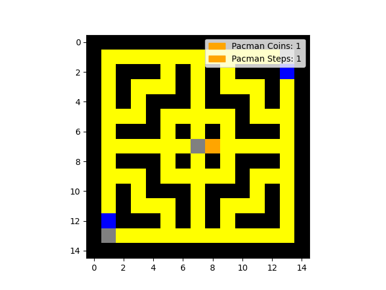
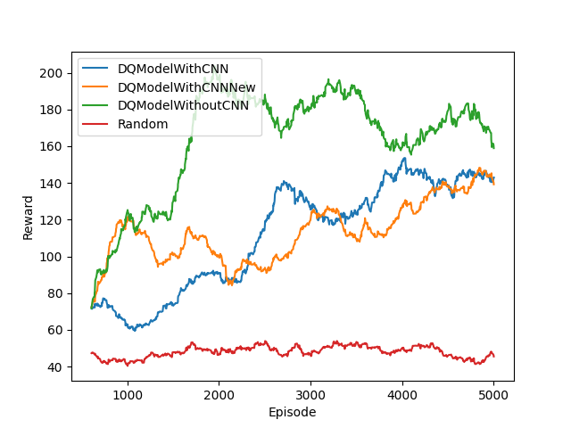

# pacman-ai3

This project aims to create a Pac-Man environment for reinforcement learning and solve this environment by applying Deep Q-Networks.

https://user-images.githubusercontent.com/52852098/180603840-3ee2cff9-20e2-40e5-9588-7a3809f49253.mp4

## Environment
The Pac-Man environment is built up on customized maps which can be found inside the 'map' folder. Each number maps to a specific part of the environment as follows:

- '0': empty field - can be walked on
- '1': wall - cannot be crossed
- '2': spawnpoint of Pac-Man (only one per map allowed)
- '3': spawnpoints of ghosts (multiple spawnpoints will generate mulitple ghosts).

The map must be enclosed by walls. The following picture shows an example map called 'small_map_quadratic.csv'. Walls are displayed in black, coins in yellow, empty fields in grey, ghosts in blue and Pac-Man in orange.



Ghosts go in one direction until they either run into a dead end or hit a crossroads. When they reach such a point, the permissible directions are determined and it is randomly decided which way to go next. The direction from which the ghost comes is not permissible at a crossing.

Pac-Man is controlled by an agent. An agent in turn contains a model that makes the predictions for the agent. The agent follows the epsilon-greedy-scheme for training. In the 'model.py' some models are already implemented, which build on the base class contained therein. Basically, Pac-Man can move according to the four cardinal directions and always takes exactly one step. Pac-Man can't walk crosswise and can't stop.

An episode can be ended in several ways. Firstly, Pac-Man can touch a ghost, and secondly, the maximum number of steps can be reached. In addition, an episode also ends when Pac-Man has collected all the coins on the map.

In each step, the environment determines rewards for based on the state of the environment. The amount of rewards can be set when training a model. Rewards are issued in the following cases:

- 'reward_for_coin' (+): is output when Pac-Man has collected a coin in the step
- 'reward_for_step' (+): is output in each time step
- 'reward_for_inactive' (-): is output if Pac-Man has not changed his position (e.g. has run into a wall)
- 'reward_for_hit' (-): is output when Pac-Man is on the same field with a ghost
- 'reward_for_max_steps' (-): is output if no other termination criterion has occurred within the time steps

The signs by the descriptions indicate whether the reward should be chosen as a rule positive or negative.

## Usage
Basically there are two applications, whose rough functionality is described below. The 'main.py' contains the training and testing of the models. With
```
python main.py -h
```
the dynamically adjustable parameters can be viewed. In the section about the performed analyses an example call is shown. With the parameter '-m' or '--mode' you can switch between training and testing. A more detailed description of all parameters can be found in the help function.

The 'visualize.py' can be called via
```
python visualize.py
```
There are no customizable parameters available. Visualizations of the reward per episode are made for all '.csv' files contained in the 'data' folder. This requires the csv data as it can be downloaded from tensorboard. The file name should not be changed since the name of the run will be used inside the legend. The files must be placed inside the 'data' folder. The image will be generated inside the 'img' folder. A sliding window with size N=100 will be applied to reduce the noise.

## Workflow
The following describes a typical workflow for working with this project, allowing new models to be implemented and tried out quickly.

1. create new model
2. load model into 'main.py' and replace 'MODEL' constant in the file
3. training the model by calling `python model.py -m train` with the selected parameters
4. viewing the written data in tensorboard with `tensorboard --logdir tensorboard` in the root folder of this project
5. download the reward for each relevant run and place it in the 'data' folder
6. call 'python visualize.py
7. view image in 'img' folder.

Alternatively, run a test pass after the third step with `python main.py -m play`.


## Trainings and Results
In the course of this project, three different models were implemented and over 5000 episodes trained. An example call looks like this:
```
python main.py -id DQModelWithCNN -m train -map small_map_quadratic.csv -ne 5000 -tu 50 -st 10 -ie 1 -lr 0.00025 -rfc 5 -rfs 0.1 -rfi -0.1 -rfh -10 -rfw 20 -rfms -10 -ms 500 -pc 1
```
All other parameters are set according to the default values. Additionally a completely random model was tested. The call for this is:
```
python main.py -id Random -m train -map small_map_quadratic.csv -ne 5000 -tu 50 -st 10 -ie 1 -ed 1 -lr 0 -rfc 5 -rfs 0.1 -rfi -0.1 -rfh -10 -rfw 20 -rfms -10 -ms 500 -pc 1
```



The 'DQModelWithCNN' and 'DQModelWithCNNNew' models differ in the number of hidden and convolutional layers and their hyperparameters. Open [model.py](model.py) For a detailed look at the differences.

The picture shows that the model without CNN performs better than the models with CNN on the first 5000 episodes. However, it also shows that the models in the further course of the training have quite a chance to become better than the model without CNN. Furthermore, it is shown that all models perform better already at the beginning than the completely random choice of action.
